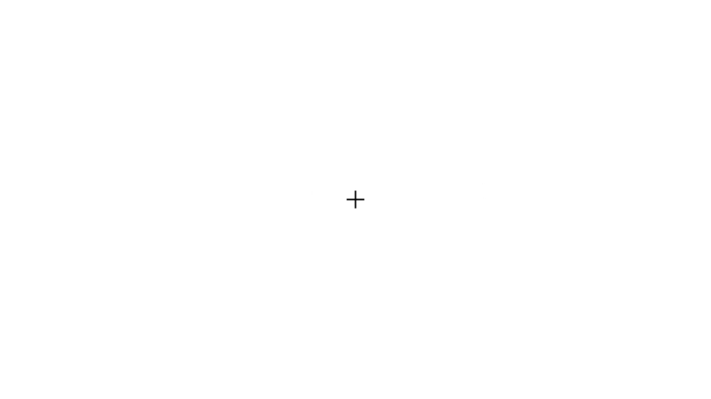

# ANT

The attention network test (ANT) is an experimental paradigm created by [Fan, McCandliss, Sommer, Raz, and Posner (2002)](https://doi.org/10.1162/089892902317361886) for studying the attention networks of alerting, orienting, and executive function. This experiment program is a direct replication of the Fan et al. (2002) paradigm using the KLibs framework.




## Requirements

This version of the ANT is programmed in Python 2.7 (3.3+ compatible) using the [KLibs framework](https://github.com/a-hurst/klibs). It has been developed and tested on macOS (10.9 through 10.13), but should also work with minimal hassle on computers running [Ubuntu](https://www.ubuntu.com/download/desktop) or [Debian](https://www.debian.org/distrib/) Linux, as well as on computers running Windows 7 or newer with [a bit more effort](https://github.com/a-hurst/klibs/wiki/Installation-on-Windows).

## Getting Started

### Installation

First, you will need to install the KLibs framework by following the instructions [here](https://github.com/a-hurst/klibs).

Then, you can then download and install the experiment program with the following commands (replacing `~/Downloads` with the path to the folder where you would like to put the program folder):

```
cd ~/Downloads
git clone https://github.com/a-hurst/ANT.git
```

### Running the Experiment

This version of the ANT is a KLibs experiment, meaning that it is run using the `klibs` command at the terminal (running the 'experiment.py' file using python directly will not work).

To run the experiment, navigate to the ANT folder in Terminal and run `klibs run [screensize]`,
replacing `[screensize]` with the diagonal size of your display in inches (e.g. `klibs run 24` for a 24-inch monitor).

If you just want to test the program out for yourself and skip demographics collection, you can add the `-d` flag to the end of the command to launch the experiment in development mode.
